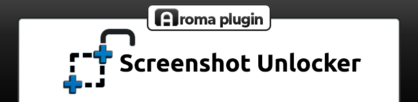

# Screenshot Unlocker

Some Wii U games and apps block the upload of screenshots to Miiverse and Web
Browser. This plugin removes this restriction, it always allows screenshot uploads.

Note: this plugin has no relationship to the [official Screenshot
plugin](https://github.com/wiiu-env/ScreenshotWUPS) from Aroma.

    

## Usage

Just open any game or app that would normally prevent you from posting screenshots (like
Monster Hunter 3 Ultimate), and try to upload them (to a web page, or to Miiverse); you'll
see the screenshot of both gamepad and TV are available for posting.

### Uploading to web pages

Most free image upload websites on the internet use either JavaScript or SSL certificates
that the Wii U's web browser doesn't support. To test image uploads, I created a test web
server in Python/CherryPy that I run on my local network:
https://github.com/dkosmari/imgupload-server . With this, you can upload screenshots
directly to your PC.

## Build Instructions

### Local Build

If you got the source from a release tarball, you can skip step 0.

Build steps:

  0. `./bootstrap`

  1. `./configure --host=powerpc-eabi CXXFLAGS="-Os -ffunction-sections -fdata-sections"`

  2. `make`

This is a standard Automake package. See `./configure --help` for more options.

### Docker Build

If you have Docker available, just run the script `docker-build.sh`.

## Special Thanks

- @ingunar for the banner and icon.
